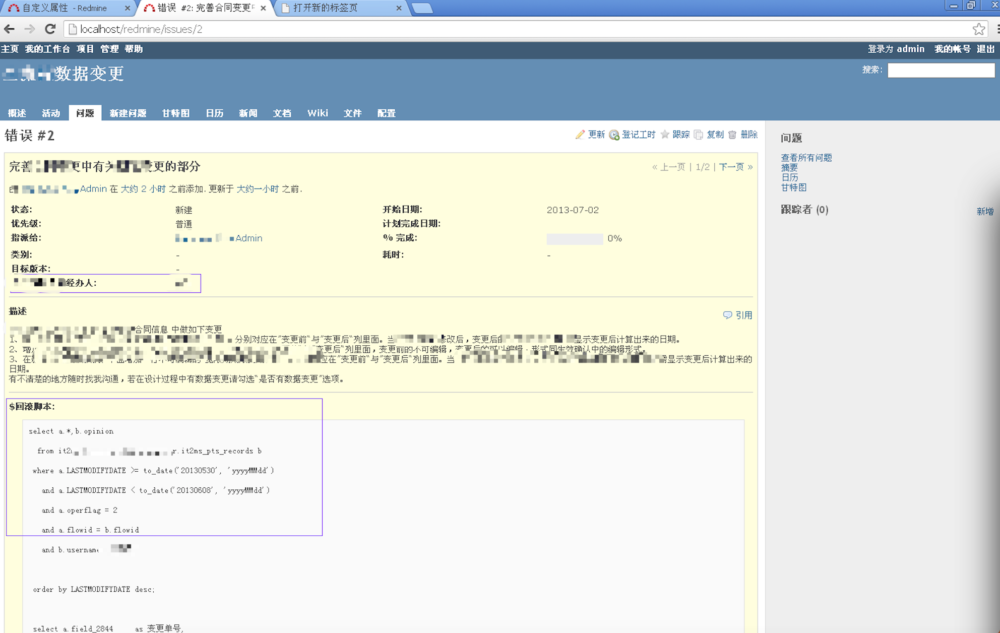
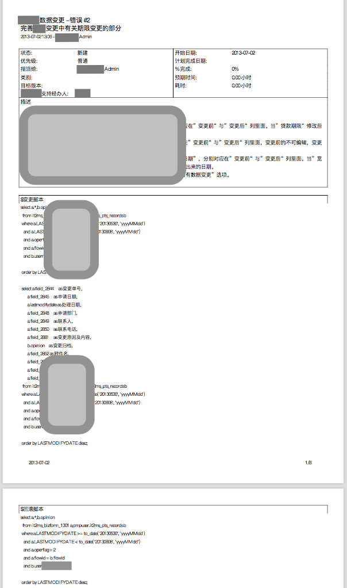

# Redmine自定义文本域和导出PDF的临时补丁
当年写的博客：[redmine自定义长文本字段显示及导出pdf排版问题临时解决方案]（https://my.oschina.net/hexie/blog/142134）
## 摘要
> 问题介绍:因项目组2月底正式引进了redmine2.2.1管理从需求到开发到测试到上线的任务跟踪，近期又想将另一个数据变更系统的数据定时导入redmine来跟踪分发管理，以尽可能的避免丢失变更单的情况。
> 直接带来的一个问题就是自定义些许字段来放置数据变更单审批系统的数据，其中就牵涉到几个长文本字段。如：变更原因及内容、备份脚本、回滚脚本、变更脚本等；这些通过自定义类型为长文本的字段后即可使用，问题来了：
> + 在issue现实页，自定义长文本字段混在自定义的字符串字段中，页面不好看；
> + 在issue页导出pdf时，自定义的长文本字段又仅显示一行，自动隐藏溢出的字符；

附，当年查找参考过的链接：

+ [搜索 - Redmine PDF + export](http://www.redmine.org/projects/redmine/search?utf8=✓&q=PDF+export)
+ [Change PDF export page layout - Redmine](http://www.redmine.org/boards/2/topics/36806?r=37394#message-37394)
+ [Defect #13860- Text of custom fields is not wrapped in PDF exports of issues - Redmine](http://www.redmine.org/issues/13860)
+ [How do I override pdf.rb- - Redmine](http://www.redmine.org/boards/3/topics/19348)
+ [Is it possible to manage position of custom fields- - Redmine](http://www.redmine.org/boards/2/topics/21056)
+ [Patch #13589- Wiki PDF export for 2 column tables - Redmine](http://www.redmine.org/issues/13589)
+ [Redmine Extended Fields - Bug #2182- internal error opening custom fields - Projects](http://projects.andriylesyuk.com/issues/2182)
+ [Redmine Extended Fields - Extended Fields 0.2.1 with Redmine 2.2.x support - Projects](http://projects.andriylesyuk.com/news/55)
+ [redmine pdf.rb - Google 搜索](https://www.google.com.hk/search?q=redmine+pdf.rb&newwindow=1&safe=strict&ei=X0TSUYWAHcTVkAXz0oDwCw&start=10&sa=N)
+ [Redmine V2.3 - Generate PDF Report with own layout - Redmine](http://www.redmine.org/boards/3/topics/37379)
+ [Single column custom fields - Plugins - Redmine](http://www.redmine.org/plugins/single_column_custom_fields)
+ [tcpdf html输出 - Google 搜索](https://www.google.com.hk/search?q=tcpdf+html输出&newwindow=1&safe=strict&ei=xm7SUfmbM4XkkgX0p4GACw&start=10&sa=N)
+ [TCPDF使用教程](http://ww29.ec-shalom.com/181_tcpdfshiyongjiaocheng.html)
+ [the exported PDF Can't display the right layout - Redmine](http://www.redmine.org/boards/2/topics/38434)


## 修订清单

+ 文件：issues_helper.rb 	地址：app\helpers\issues_helper.rb
  + 文件：show.html.erb 		地址：app\views\issues\show.html.erb
    + 文件：pdf.rb 				地址：lib\redmine\export\pdf.rb

## 修订详情

修订render_custom_fields_rows(issue)函数；判断自定义的长文本字段不显示
新增render_custom_fields_rows2(issue)函数；判断如为自定义的长文本字段则显示；

### 原函数：

```ruby
  def render_custom_fields_rows(issue)
    return if issue.custom_field_values.empty?
    ordered_values = []
    half = (issue.custom_field_values.size / 2.0).ceil
    half.times do |i|
      ordered_values << issue.custom_field_values[i]
      ordered_values << issue.custom_field_values[i + half]
    end
    s = "<tr>\n"
    n = 0
    ordered_values.compact.each do |value|
      s << "</tr>\n<tr>\n" if n > 0 && (n % 2) == 0
      #s << "\t<th>#{ h(value.custom_field.name) }:</th><td>#{ simple_format_without_paragraph(h(show_value(value))) }</td>\n"
      if h(value.custom_field.name).include?"$"
      	#s << "\t<th>#{ h(value.custom_field.name) }:</th><td colspan=\"3\">#{ simple_format_without_paragraph(h(show_value(value))) }</td>\n"
      else
      	s << "\t<th>#{ h(value.custom_field.name) }:</th><td>#{ simple_format_without_paragraph(h(show_value(value))) }</td>\n"
    	end
      n += 1
    end
    s << "</tr>\n"
    s.html_safe
  end
```

### 修订为

```ruby
  def render_custom_fields_rows(issue)
    return if issue.custom_field_values.empty?
    ordered_values = []
    half = (issue.custom_field_values.size / 2.0).ceil
    half.times do |i|
      ordered_values << issue.custom_field_values[i]
      ordered_values << issue.custom_field_values[i + half]
    end
    s = "<tr>\n"
    n = 0
    ordered_values.compact.each do |value|
      s << "</tr>\n<tr>\n" if n > 0 && (n % 2) == 0
      #s << "\t<th>#{ h(value.custom_field.name) }:</th><td>#{ simple_format_without_paragraph(h(show_value(value))) }</td>\n"
      if h(value.custom_field.name).include?"$"
      	#s << "\t<th>#{ h(value.custom_field.name) }:</th><td colspan=\"3\">#{ simple_format_without_paragraph(h(show_value(value))) }</td>\n"
      else
      	s << "\t<th>#{ h(value.custom_field.name) }:</th><td>#{ simple_format_without_paragraph(h(show_value(value))) }</td>\n"
    	end
      n += 1
    end
    s << "</tr>\n"
    s.html_safe
  end
```

## 新增自定义文本域函数 

render_custom_fields_rows2(issue)函数

```ruby
  def render_custom_fields_rows2(issue)
    return if issue.custom_field_values.empty?
    ordered_values = []
    half = (issue.custom_field_values.size / 2.0).ceil
    half.times do |i|
      ordered_values << issue.custom_field_values[i]
      ordered_values << issue.custom_field_values[i + half]
    end
    s = "<tr>\n"
    n = 0
    ordered_values.compact.each do |value|
      s << "</tr>\n<tr>\n" if n > 0 && (n % 2) == 0
#######s << "\t<th>#{ h(value.custom_field.name) }:</th><td>#{ simple_format_without_paragraph(h(show_value(value))) }</td>\n"
      if h(value.custom_field.name).include?"$"
      	s << "\t<p><strong><th>#{ h(value.custom_field.name) }:</th></p></strong></tr>\n<tr>\n<td colspan=\"3\"><pre>#{ simple_format_without_paragraph(h(show_value(value))) }</pre></td>\n"
      end
#######
      n += 1
    end
    s << "</tr>\n"
    s.html_safe
  end
```

## 文件：show.html.erb 	

新增自定义长文本字段的展现在描述后

### 变更以下代码

```html
<% if @issue.description? %>
<div class="description">
  <div class="contextual">
  <%= link_to l(:button_quote), quoted_issue_path(@issue), :remote => true, :method => 'post', :class => 'icon icon-comment' if authorize_for('issues', 'edit') %>
  </div>

  <p><strong><%=l(:field_description)%></strong></p>
  <div class="wiki">
  <%= textilizable @issue, :description, :attachments => @issue.attachments %>
  </div>
</div>
<% end %>
```

### 为：

```html
<% if @issue.description? %>
<div class="description">
  <div class="contextual">
  <%= link_to l(:button_quote), quoted_issue_path(@issue), :remote => true, :method => 'post', :class => 'icon icon-comment' if authorize_for('issues', 'edit') %>
  </div>

  <p><strong><%=l(:field_description)%></strong></p>
  <div class="wiki">
  <%= textilizable @issue, :description, :attachments => @issue.attachments %>
  </div>
</div>
<hr />
<div class="description">
	<div class="wiki">
		<%= render_custom_fields_rows2(@issue) %>
	</div>
</div>
<% end %>
```

## 文件：pdf.rb 

代码1：修订自定义长文本字段不在属性里显示；
代码2：修订自定义长文本字段在描述后显示；		

### 找到以下代码1：

```ruby
        half = (issue.custom_field_values.size / 2.0).ceil
        issue.custom_field_values.each_with_index do |custom_value, i|
          	(i < half ? left : right) << [custom_value.custom_field.name, show_value(custom_value)]          
        end
```

### 修订为：

```ruby
        half = (issue.custom_field_values.size / 2.0).ceil
        issue.custom_field_values.each_with_index do |custom_value, i|
        	#############
        	if custom_value.custom_field.name.include?"$"
        	else
          	(i < half ? left : right) << [custom_value.custom_field.name, show_value(custom_value)]
          end
          #############
        end	
```

### 找到以下代码2：

```ruby
		pdf.SetFontStyle('B',9)
        pdf.RDMCell(35+155, 5, l(:field_description), "LRT", 1)
        pdf.SetFontStyle('',9)
        # Set resize image scale
        pdf.SetImageScale(1.6)
        pdf.RDMwriteHTMLCell(35+155, 5, 0, 0,
              issue.description.to_s, issue.attachments, "LRB")
```

### 修订为：

```ruby
修订为：
        pdf.SetFontStyle('B',9)
        pdf.RDMCell(35+155, 5, l(:field_description), "LRT", 1)
        pdf.SetFontStyle('',9)
        # Set resize image scale
        pdf.SetImageScale(1.6)
        pdf.RDMwriteHTMLCell(35+155, 5, 0, 0,
              issue.description.to_s, issue.attachments, "LRB")
##########
				issue.custom_field_values.each_with_index do |custom_value, i|
        	if custom_value.custom_field.name.include?"$"        		
        		 itemcusname = custom_value.custom_field.name
        		 itemcusvalue = show_value(custom_value)
        		 pdf.SetFontStyle('B',9)
        		 pdf.RDMCell(35+155, 5, (itemcusname.to_s), "LRT", 1)
        		 pdf.SetFontStyle('',8)
        		 pdf.SetImageScale(1.6)
        		 pdf.RDMMultiCell(35+155, 5, itemcusvalue.to_s)
        	else
          	
          end
          pdf.Ln
        end

######
```

# 看看效果

## 系统中自定义多行文本

 

## 导出pdf
[工单导出pdf（测试）](screenshoots/datachange-2 (测试).pdf)

 
